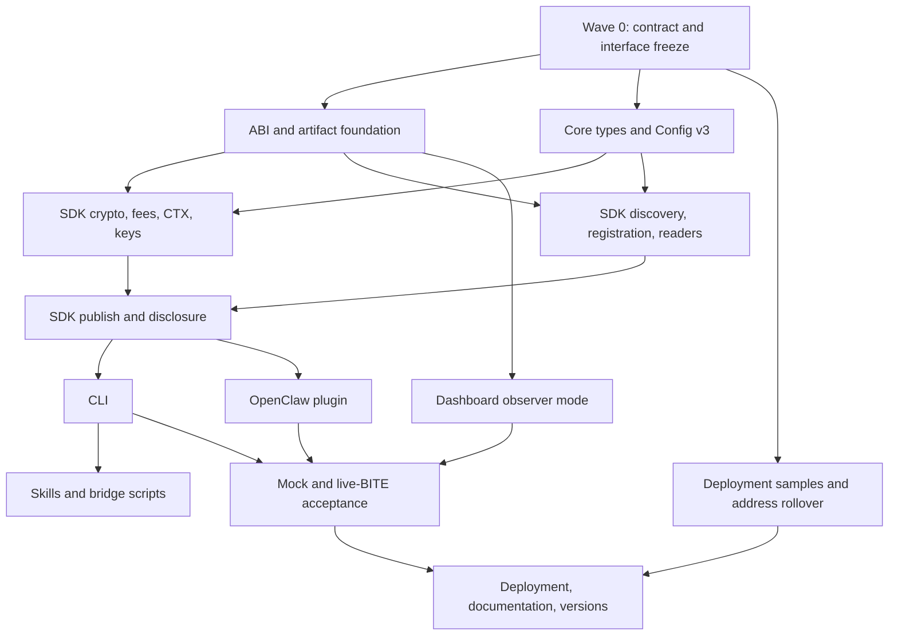

# Encrypted Channels — Implementation Roadmap

This roadmap turns [`encrypted-channels-propagation.md`](./encrypted-channels-propagation.md)
into dependency-aware implementation tracks. Its scope follows that survey:

- everything outside `smart-contracts/` that must become compatible with encrypted channels;
- contract changes only where they affect the downstream compatibility boundary;
- `open-claw-setups/` and the stale Python stub remain excluded.

## Status (2026-08-17)

Done and verified: **Wave 0**, **Track 1**, **Track 2**, **Track 3A**, **Track 6**, and the
deploy-script half of **DEPLOY**. Gates at time of writing: 182 contract tests, 134 lint files,
six type-checks, and 67/7/18/20 across the SDK, plugin, CLI-unit and CLI-integration lanes.

Wave 0 decisions, now settled and implemented:

1. `SmartClawsDeviceGroup` **gained** the reader passthroughs (see propagation §11.2).
2. The split device sets **stay**; consumers merge them (see propagation §11.4).

Next, in order:

- **Track 3B** (`contracts.ts`, discovery, readers) — unblocked; the only remaining SDK
  prerequisite for 3C. The legacy-registry fix below belongs here.
- **DEPLOY, run for real** — `deploy.ts` now creates encrypted samples but has never been
  executed against SKALE. This gates the live lane, which is the only lane that proves anything.
- **Track 3C**, then **4 + 5** in parallel, then **7**.

Carried forward, owned by no track:

- Wire 3A into `index.ts` and `Config` — deliberately deferred so parallel agents would not
  collide on those files.
- Key rotation: `registerPublicKey` silently overwrites, so a rotation between `requestMessages`
  and its callback makes that disclosure permanently undecryptable and the fee spent.
- Spend budget/telemetry for paid reads.

### Corrections this document needs

- **The legacy-registry contradiction.** Track 7 says preserve the user's registry address on
  migration, while Track 3B queries both device sets and decision 3 resolves `publicKeyRegistry()`.
  The deployed registry predates both and answers neither, so a preserved config plus the new SDK
  reverts on ordinary discovery. Migration currently preserves the address and marks the hazard
  with `TODO(legacy-registry):`; **3B must add explicit legacy tolerance or force the move.**
- **DEPLOY is mis-sequenced.** It is drawn as a leaf feeding only RELEASE, but the live lane
  cannot run until it lands, so following the graph literally means writing every consumer blind.
  Treat it as an early track.
- **ECIES here is unauthenticated** (no MAC). "Decrypted, but the plaintext is not a valid
  envelope" is therefore an expected error class, not a bug — see `InvalidDecryptedEnvelopeError`.

### Facts established against a live chain

These cannot be reproduced locally — **BITE has no local simulation** — so they are recorded here
rather than re-derived. Origin tx `0x25d923aa…c698` on base-testnet:

- `bite_getCraftedCtxs` returns a **flat array of bare 64-char hex strings, with no `0x` prefix**.
  A parser requiring the prefix matches nothing and reports "no CTX" for every successful publish.
- The CTX landed in the **very next block, 1s after the origin**, and emitted
  `MessagePublished(address,uint256)`. The retry default is set from this measurement.
- Registering an encrypted entity deploys two `SmartClawsChannelEncrypted` instances, which
  exceeds Hardhat's 2^24 per-transaction cap locally. That cap is *not* the block gas limit and
  cannot be read from a block; SKALE's ~230M limit is unaffected.

## Outcome

The work can run in parallel after a short contract and interface freeze.



## Recommended decisions

1. Plain channels remain the default. Encryption is opt-in with `--encrypted`.
2. Add optional `Config.biteRpcUrl`; resolve BITE RPC as `biteRpcUrl || rpcUrl`.
3. Resolve `publicKeyRegistry()` from `SmartClaws` and memoize it in-process. Do
   not persist a second address that can disagree with the selected registry.
4. Resolve and cache channel kind using `isEncrypted()`. Kind is immutable for a
   channel address; an absent legacy cache value must be queried, never assumed plain.
5. Keep the free ciphertext read separate from paid disclosure:
   - SDK: `readMessages` and `discloseMessages`;
   - CLI: `read` and explicit `--disclose`/`--decrypt`;
   - plugin: `smartclaws_read` and optional `smartclaws_disclose`.
6. Publishing waits for CTX confirmation by default. `--no-wait` returns an
   explicitly `scheduled` result.
7. Reject disclosure batches above 10 initially. Do not silently create multiple
   paid transactions.
8. Ship the dashboard in observer mode first. Paid browser disclosure remains a
   separate design project involving wallet connection and viewing-key custody.
9. Use a strict local CTX correlation helper initially. Reconsider the prerelease
   privacy SDK after its exports, hash parsing, and version compatibility stabilize.

## Wave 0 — compatibility gate

Complete these decisions before generating the final ABIs:

- Decide whether `SmartClawsDeviceGroup` needs incoming/outgoing reader
  passthrough functions for legacy group-admin-only devices.
- Do not add a combined device getter unless it returns address and channel kind.
  A plain address array still forces per-channel detection and provides little value.
- Freeze the public TypeScript result shapes and CLI/plugin naming below.

The default recommendation is:

- add the reader passthrough if legacy/direct callers must be fully supported;
- keep the two paginated device sets and merge them in consumers;
- do not add standalone channel-management CLI commands in this release. Direct
  encrypted channels remain readable and publishable when their address is supplied.

## Track 1 — ABI and artifact foundation

Primary files:

- `smart-contracts/scripts/export-abi.sh`
- `packages/core/abi/*.json`
- `.github/workflows/typescript.yml`

Tasks:

1. Export `SmartClawsChannelEncrypted` and `PublicKeyRegistry` in addition to the
   five existing contracts.
2. Compile and regenerate all seven committed `{ abi, bytecode }` artifacts.
3. Add `git diff --exit-code -- packages/core/abi` after export in CI.
4. Build and type-check every ABI consumer.

Acceptance:

- `SmartClaws` has its six-argument constructor and encrypted registry methods.
- Registration events include indexed `encrypted`.
- Device and agent publishes are payable and expose scheduled events and reader APIs.
- Both channel ABIs expose the correct encryption-specific surface.
- A fresh compile/export produces no committed ABI diff.

## Track 2 — core models and configuration

Primary files:

- `packages/core/src/types.ts`
- `packages/sdk/src/config.ts`
- SDK config and discovery tests

Recommended model:

```ts
interface Config {
  version: 3;
  biteRpcUrl?: string;
  // existing fields unchanged
}

interface DeviceFile {
  encrypted?: boolean;
}

interface AgentFile {
  encrypted?: boolean;
}

interface GroupFile {
  devices: string[];       // merged canonical list
  deviceCount: number;     // total across both sets
  plainDevices?: string[];
  plainDeviceCount?: number;
  encryptedDevices?: string[];
  encryptedDeviceCount?: number;
}
```

Add `isIncomingReader?` and `isOutgoingReader?` to entity capabilities. Public-key
status belongs on wallet/encryption status, rather than being repeated on every entity.

Acceptance:

- Config v1 and v2 migrate to v3 without losing attachments or wallet identity.
- Old entity JSON remains readable.
- Fresh hydration always persists authoritative encryption state.
- Mixed groups have deduplicated addresses and correct total/breakdown counts.

## Track 3 — SDK

### 3A. Encryption, keys, fees, and CTX

Primary files:

- `packages/sdk/package.json`
- new `src/services/encryption.ts`
- new `src/services/ctx.ts`
- new `src/services/keys.ts`
- `src/errors.ts`
- `src/index.ts`

Required invariants:

- Encode encrypted publication as `abi.encode(walletAddress, envelopeBytes)`.
- The encoded address is always the signing wallet, not the envelope `dev`, device,
  agent, or channel owner.
- Call `encryptMessageForCTX(framedHex, channelAddress)`. The AAD address is always
  the channel that calls `submitCTX`.
- Measure ciphertext in bytes, not hex characters.
- Fetch one gas price, compute `callbackGas * gasPrice`, and submit with that exact
  explicit gas price and value.
- These are ordinary outer contract transactions carrying CTX ciphertext, not BITE1
  encrypted transactions routed to the magic address.
- CTX correlation accepts only 32-byte hashes, normalizes and deduplicates them,
  retries only not-found results, and waits for every returned receipt.
- ECIES validation checks the 16-byte IV, 33-byte compressed ephemeral key, nonempty
  block-aligned ciphertext, ECDH, SHA-256 KDF, and AES-256-CBC padding.

Introduce an injectable `EncryptionProvider`. Production uses BITE; unit tests use a
spy/fake that records the AAD address and returns controlled ciphertext.

### 3B. Contracts, discovery, registration, and readers

Primary files:

- `src/contracts.ts`
- `src/services/discovery.ts`
- new `src/services/readers.ts`

Tasks:

- Add encrypted-channel and public-key-registry clients.
- Memoize channel kind and public-key-registry resolution.
- Query both device sets in parallel and carry the known kind into hydration.
- Query one channel's `isEncrypted()` when hydrating an address without provenance.
- Query reader membership only for encrypted channels.
- Add opt-in encrypted device and agent registration.
- Assert the registration event's `encrypted` value matches the requested kind.
- Add reader APIs for device, agent, and EOA-owned direct channels.

### 3C. Publish and disclosure

Replace ambiguous success with a discriminated result:

```ts
type PublishState =
  | "published"
  | "scheduled"
  | "origin-reverted"
  | "ctx-reverted";
```

Rules:

- Plain origin success plus its matching `MessagePublished` means `published`.
- Encrypted origin success without waiting means `scheduled`.
- Encrypted publication means `published` only after a successful CTX receipt with
  the matching `MessagePublished(channel, offset)` event.
- A successful receipt without the expected event is `CTX_FAILED`.
- Callback funding is labelled a callback deposit, not the final cost, because
  refunds are asynchronous and failures can strand value.

`readMessages` stays walletless. Encrypted entries return `encrypted`, `rawHex`,
`ciphertextHex`, and `ciphertextBytes`, without `decodeError`.

`discloseMessages` must:

1. require an encrypted channel and a batch of 1–10;
2. verify reader authorization and public-key registration;
3. view-read the exact ciphertext range and sum byte lengths;
4. quote gas and send `requestMessages` with the same gas price used for the deposit;
5. wait for every CTX and collect matching `MessageDisclosed` events;
6. verify channel, reader, offsets, uniqueness, and completeness;
7. decrypt each ECIES payload and feed the raw envelope bytes to the existing decoder.

## Track 4 — CLI

Primary files:

- `commands/publish.ts`
- `commands/read.ts`
- `commands/device.ts`
- `commands/agent.ts`
- `commands/init.ts`
- `commands/discover.ts`
- `commands/whoami.ts`
- new `commands/key.ts`
- `src/index.ts`

Commands and behavior:

- `device register --encrypted`
- `agent register --encrypted`
- `device reader add|remove|list --channel incoming|outgoing`
- `agent reader add|remove|list --channel incoming|outgoing`
- `key register|show|remove`
- `init --bite-rpc-url`
- `init --encrypted` for entities created during that invocation
- publish `--wait`/`--no-wait`, with waiting as the default
- read `--disclose`, with `--decrypt` as an optional alias

Do not automatically register a public key for an unfunded new wallet. Present
`smartclaws key register` as a post-funding action.

Acceptance:

- Plain behavior remains intact and sends zero value.
- Encrypted no-wait output says `Scheduled`, never `Published`.
- JSON output stringifies bigint fee fields.
- `whoami` only reports reader status for attached or cached channels; no global reader
  membership index exists.

## Track 5 — OpenClaw plugin

Primary files:

- `packages/openclaw-plugin/src/plugin-config.ts`
- `src/tools/read.ts`, `publish.ts`, `notify.ts`, `wallet-info.ts`, `index.ts`
- new `src/tools/disclose.ts`
- manifest, package metadata, README, and unit tests

Plan:

- Keep `smartclaws_read` wallet-free and return labelled ciphertext metadata.
- Add optional `smartclaws_disclose`, which signs, pays, waits, and decrypts.
- Make publish and notify wait by default.
- A timeout remains `scheduled/unknown`; it is never rewritten as success.
- Extend wallet info with public-key readiness and reader status for known channels.
- Mark the disclosure tool optional in the manifest.
- Bump plugin `0.2.0` to `0.3.0` and keep manifest/package versions equal.

## Track 6 — dashboard

The dashboard currently has no wallet connection or write path. The first compatible
release should therefore be observer-only.

Independent dashboard subtracks:

1. Merge plain and encrypted device discovery and counts.
2. Add a reusable channel-kind query.
3. Render encrypted messages as ciphertext metadata, never decode errors.
4. Exclude ciphertext from telemetry charts.
5. Display reader ACLs separately from AccessControl roles.
6. Use `MessagePublished` plus block time for encrypted activity/liveness.
7. Label capacity as stored ciphertext bytes.

Paid browser disclosure is deferred until the project deliberately designs wallet
connection, fee confirmation, CTX waiting, and viewing-key custody.

## Track 7 — skills, demos, and documentation

### Skills

- Add `skills/operational/smartclaws-encrypted-channels/SKILL.md`.
- Update the main, master-agent, and bridge-agent skills.
- Add encryption kind and reader readiness to `SMARTCLAWS.example.md`.
- Extend both authority templates to cover spending funds on reads.
- Keep device topic/payload schemas unchanged; encryption is transport-level.

Every skill must distinguish free ciphertext inspection from paid disclosure and must
treat encrypted publication as scheduled until confirmed.

### Bridge and demo scripts

Update existing scripts instead of creating duplicated encrypted variants:

- `dev/shelly-bridge.py`
- `dev/shelly-sim.py`
- `dev/thermal-sim.py`
- `dev/setup-local-three-agent-demo.sh`

Poll free message-count/latest-offset metadata first. Disclose only unseen offsets,
chunking backlogs into batches of at most 10. Persist state only after successful
disclosure and command handling.

Encrypted demo setup must register keys after funding and idempotently grant the full
reader graph.

### Documentation and release

- Update `README.md`, `ARCHITECTURE.html`, and the plugin README.
- Add a user-facing `docs/encrypted-channels.md`.
- Record resolved decisions and completion status in the propagation document.
- Update `.github/copilot-instructions.md`, which currently describes four tools.
- Fix version scripts so the SDK and plugin participate.
- Preserve existing user registry addresses during config migration; moving to the new
  encrypted deployment must be deliberate.

## Testing strategy

Three lanes are required because each proves a different property:

### Unit lane

Use an injected encryption provider to prove:

- exact wallet/envelope ABI framing;
- channel address used as AAD;
- ciphertext byte fee calculation and explicit gas-price reuse;
- strict CTX hash parsing and matching-event requirements;
- ciphertext labelling and disclosure validation;
- config and mixed-discovery migrations.

### Contract-flow lane

Install the Solidity BITE precompile shims on Anvil and use `TestBiteMock` to prove:

- origin schedules without storing;
- callback publishes and emits the expected event;
- public-key and reader prerequisites;
- disclosure event flow;
- insufficient fee, revocation, pause, unauthorized callback, and batch limits.

### Live-BITE lane

Run an opt-in or protected-network smoke test for:

- real `encryptMessageForCTX` interoperability;
- channel-address AAD enforcement;
- origin-to-CTX RPC correlation;
- exact callback fee/gas behavior;
- real ECIES decryption;
- callback failure and committee-rotation behavior.

`BITEMockup` 0.8.1 does not implement `encryptMessageForCTX`, and its ciphertext is not
compatible with the Solidity `TestBiteMock`. Mock tests must not be presented as proof
of confidentiality or real AAD interoperability.

## Corrections to the propagation survey

- The repository is now at a later clean commit, not `830bb04` plus an unstaged tree.
- Adding the indexed registration flag changes event topic hashes. Stale ABIs and old
  indexer filters do not decode the new events.
- `deploy.ts` already deploys all six factories and `PublicKeyRegistry`; it lacks only
  representative encrypted entities and their verification targets.
- Current SDK device registration passes the wallet as device admin; the claim that the
  CLI sometimes passes zero is stale.
- Anvil precompile installation alone is insufficient for SDK/CLI end-to-end coverage.
- The dashboard has no connected-wallet implementation today.
- `use-agents.ts` and `dev/shelly-sim.py` are additional affected files.
- `publish/` and plugin `dist/` are generated/ignored, not committed source artifacts.
- A failed CTX cannot itself be retried, but the operation can be manually resubmitted
  with fresh ciphertext and funding.
- `overview.tsx` is optional for correctness because registry totals already contain both
  channel kinds.
- Version scripts currently omit the SDK and plugin.

## Completion definition

The propagation is complete when:

- all plaintext flows still pass unchanged;
- all SDK, CLI, plugin, dashboard, skill, and demo surfaces detect encrypted channels;
- free reads never spend and paid reads are explicitly authorized;
- no interface equates origin success with stored publication;
- mixed groups are discoverable everywhere;
- reader ACLs are never modelled as AccessControl roles;
- the live-BITE lane proves AAD, CTX correlation, fee coupling, and ECIES;
- the new registry deployment is verified and documentation points to it.
